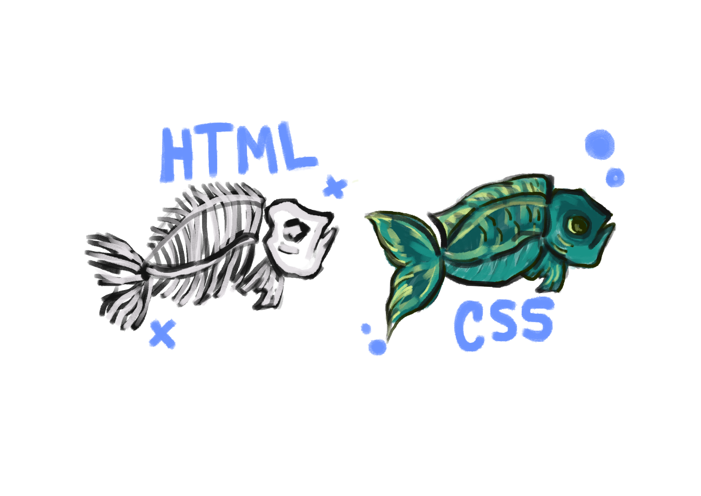

# Mnemosyne - Praticando HTML+CSS

### O seguinte repositório consta minha primeira experiência com HTML e CSS. Uma página Web simples com exemplos de formatação e criação. 

### Sobre HTML e CSS: 
Ambas são linguagens de marcação fundamentais na criação de páginas web. O HTML é a linguagem de marcação de Hipertexto, ou seja, compõem as estruturas e conteúdos, como textos, imagens e links. Enquanto o CSS são folhas de estilo em cascata, responsável pela estética do site, definindo fontes, cores, layouts e posicionamnetos. Trabalhando juntos no desenvolvimento front-end.

  
Ou em tópicos

 ## HTML 

1. Estrutura – Define a estrutura e o conteúdo da página (textos, títulos, botões, imagens).

2. Semântica – Usa tags que dão significado ao conteúdo (`<header>`, `<main>`, `<footer>`)

3. Base da Web – É o esqueleto do site; tudo começa com HTML antes de estilizar ou programar.

## CSS

1. Estilo – Controla aparência: cores, fontes, tamanhos, bordas, layout.

2. Layout – Organiza os elementos na tela usando Flexbox, Grid, Position etc.

3. Design responsivo – Adapta o site para telas diferentes com media queries.

</details

  

